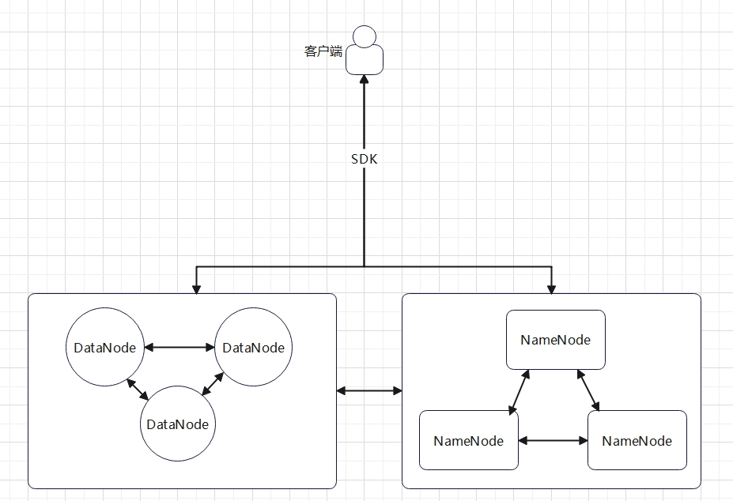

# LDFS
LDFS，轻量级的分布式存储系统

## 支持副本冗余和RS纠删码策略
### 副本冗余策略
- 文件会被分为多个块，每个块都会存储在多个DataNode上

### RS纠删码策略
- 文件会被分成多个块，每个块会经过RS纠删码编码成固定数量的Shard存储在不同的DataNode中，可以容忍一定数量的shard缺失而恢复完整文件

### 自适应的文件恢复
- 当客户端在传输文件时，如果检测到文件缺失或者错误，系统会自适应的修复文件

## raft共识算法
- 文件meta信息采用raft算法在NameNode之间进行交互

## 开箱即用，无需格式化磁盘，支持入门级服务器部署

## 系统架构图


## SDK
- 支持go的SDK调用

## Quick start
- 执行以下命令启动部署，随后运行example目录中的测试脚本即可
### Windows 
```shell
NameNode.exe -haddr localhost:11001 -raddr localhost:12001 -id NameNode1 -metadir LDFS/name-node1/meta LDFS/name-node1/db
NameNode.exe -haddr localhost:11002 -raddr localhost:12002 -id NameNode2 -metadir LDFS/name-node2/meta -join localhost:11001 LDFS/name-node2/db
NameNode.exe -haddr localhost:11003 -raddr localhost:12003 -id NameNode3 -metadir LDFS/name-node3/meta -join localhost:11001 LDFS/name-node3/db

DataNode.exe -haddr localhost:13001 -joinND localhost:11001 -id DataNode1 -shardsDir LDFS/data-node1/stards
DataNode.exe -haddr localhost:13002 -joinND localhost:11001 -id DataNode2 -shardsDir LDFS/data-node2/stards
DataNode.exe -haddr localhost:13003 -joinND localhost:11001 -id DataNode3 -shardsDir LDFS/data-node3/stards
```
### Linux
```shell
NameNode -haddr localhost:11001 -raddr localhost:12001 -id NameNode1 -metadir LDFS/name-node1/meta LDFS/name-node1/db
NameNode -haddr localhost:11002 -raddr localhost:12002 -id NameNode2 -metadir LDFS/name-node2/meta -join localhost:11001 LDFS/name-node2/db
NameNode -haddr localhost:11003 -raddr localhost:12003 -id NameNode3 -metadir LDFS/name-node3/meta -join localhost:11001 LDFS/name-node3/db

DataNode -haddr localhost:13001 -joinND localhost:11001 -id DataNode1 -shardsDir LDFS/data-node1/stards
DataNode -haddr localhost:13002 -joinND localhost:11001 -id DataNode2 -shardsDir LDFS/data-node2/stards
DataNode -haddr localhost:13003 -joinND localhost:11001 -id DataNode3 -shardsDir LDFS/data-node3/stards
```

## 未来计划
- 提供更多语言版本的SDK调用，优化部分代码


